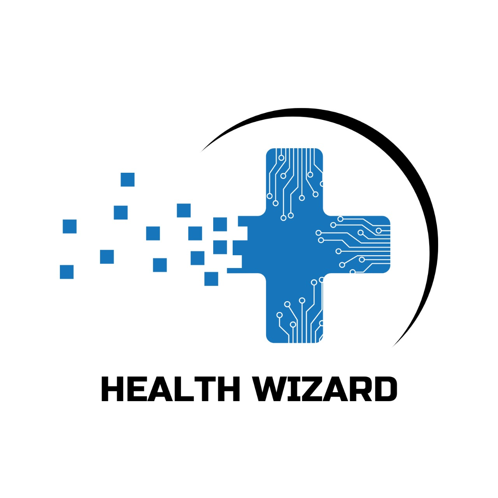

# HealthWizard



**HealthWizard** is a comprehensive medical document analysis system powered by AI. It processes prescriptions, lab reports, and other medical documents to provide insights and help with healthcare decisions.

## Features

### 🔍 Medical Document Analysis
- **Lab report PDF processing**: Extracts and processes data from lab reports in PDF format.
- **Handwritten prescription OCR**: Utilizes Optical Character Recognition (OCR) to interpret handwritten prescriptions.
- **Medical parameter visualization**: Converts medical parameters into visual charts for easy understanding.
- **Multi-language translation support**: Supports translations of medical documents across multiple languages.

### 🤖 AI-Powered Analysis
- **Prescription interpretation**: Interprets prescription details, helping users understand prescribed medications.
- **Medicine recognition**: Identifies medications from prescriptions and lab reports.
- **Medical condition analysis**: Provides analysis of medical conditions based on prescriptions and reports.
- **Parameter normalization**: Normalizes medical parameters for consistency and comparison across different reports.

### 🗺 Pharmacy Services
- **Online pharmacy search**: Find pharmacies online to purchase medications.
- **Nearby pharmacy locator**: Locates pharmacies based on your geographic location.
- **Interactive maps**: Provides interactive maps to guide users to nearby pharmacies.
- **Location-based services**: Offers tailored pharmacy services based on the user's location.

## Installation

To get started with **HealthWizard**, follow these steps:

1. **Clone the repository** or download the project files.

2. **Install dependencies**:

   Navigate to the project directory and run the following command to install the required Python packages:

   ```sh
   pip install -r requirements.txt
